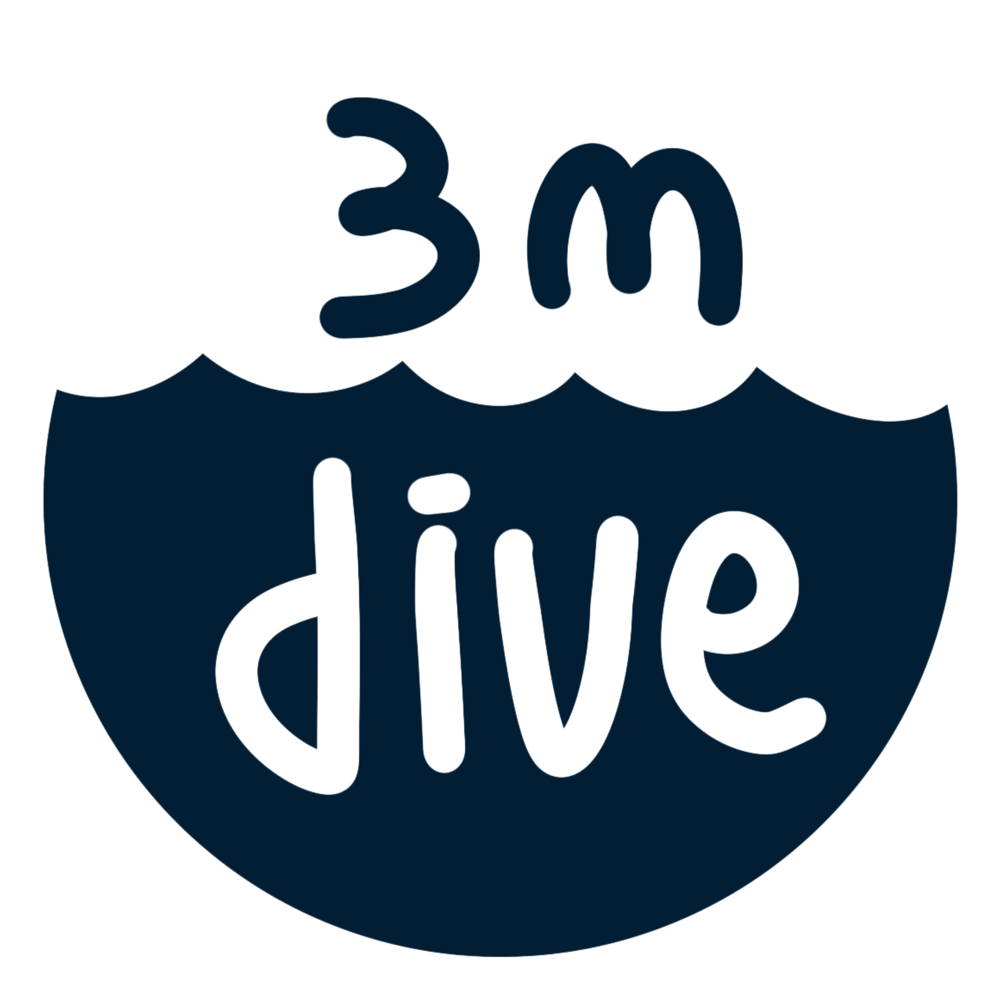

# dive3m
<p align="center">
    
</p>  

<p align="center">
  
  
  
  <a href="https://github.com/ccxt/ccxt/wiki/Exchange-Markets">
      
  </a>
</p>  

<p align="center">
  
  
  
  
  
</p>

----

`dive3m` is an automatic trading system.  

<!-- toc -->
- [Structure](#프로젝트-구조)
- [Getting Started](#getting-started)
- [Gitbook](#gitbook) - yet
- [The Team](#the-team) - yet
- [Contributing](#contributing)
<!-- tocstop -->

----

FastAPI와 함께 백엔드 API의 **Layered Architecture 패턴**을 적용한 알고리즘 트레이딩 프로젝트  
백엔드 API 분리 예정  

----

## 프로젝트 구조
```
.
├── README.md
├── setup.py
├── requirements.txt
├── backend
│   ├── README.md
│   ├── main.py
│   ├── requirements.txt
│   ├── db_config.py
│   ├── common
│   │   ├── __init__.py
│   │   └── db.py
│   ├── model
│   │   ├── __init__.py
│   │   └── tradingview.py
│   ├── router
│   │   ├── __init__.py
│   │   └── router_trade.py
│   └── services
│       ├── __init__.py
│       ├── trade_pnf.py
│       └── trade_dca.py
├── config
│   └── config.yaml
├── dive3m
│   ├── __about__.py
│   ├── __init__.py
│   ├── client
│   │   ├── __init__.py
│   │   └── client.py
│   ├── fetch
│   │   ├── __init__.py
│   │   └── fetch.py
│   ├── order
│   │   ├── __init__.py
│   │   └── order.py
│   └── utils
│       ├── __init__.py
│       ├── command_poller.py
│       ├── formatting.py
│       └── logger.py
├── docker
│   ├── docker-compose.yaml
│   └── Dockerfile
├── examples
│   └── binance_trade_spot.py
├── payload
│   ├── order_info.json
│   ├── webhook_example.json
│   └── webhook_format.json
└── tests
    ├── config.py
    └── test_server.py
```

- /backend : 백엔드 API 정의 (yet)
- /config : 바이낸스 ApiKey 설정파일 -> dive3m에서 사용
- /dive3m : 바이낸스 API를 이용한 트레이딩 관련 모듈 정의
  - **Singleton 패턴** 적용
  - Client 클래스 : 바이낸스 api 로그인은 최초 1번만 하면되고 그 정보를 공유하기에 싱글톤패턴을 사용
- /docker : 서비스 컨테이너 관련 도커파일
- /examples : 샘플 코드
- /payload : request body 샘플
- /tests : 테스트 코드


## Getting started
### 1. git clone, docker build & run
```bash
$ git clone https://github.com/ojkk371/dive3m.git
$ cd dive3m/
$ USER_ID=$UID docker-compose -f docker/docker-compose.yaml up -d
$ docker exec -it dive3m bash
```

### 2. Install dive3m
```bash
$ python3 -m pip install -e .
```

### 3. config 수정
```bash
$ vi config/config.yaml
```  
API_KEY, API_SECRET 에 발급받은 자신의 바이낸스 apikey를 각각 입력하고 저장합니다.  


### 4. examples
```bash
$ cd examples/
$ sudo python3 binance_trade_spot.py

# option 이 있습니다.
# 뒤에 -h 옵션을 붙여서 실행하시면 옵션에 대한 설명이 나옵니다.
# ex) sudo python3 binance_trade_spot.py -h
```

### 5. Swagger(docs)  
서버를 실행한 후 [127.0.0.1:80/docs](http://127.0.0.1:80/docs) 에 접속하면 api에 대한 인풋/아웃풋에 대한 포맷을 확인 할 수 있습니다.   


### 6. documents(redoc)
서버를 실행한 후 [127.0.0.1:80/redoc](http://127.0.0.1:80/redoc) 에 접속하면 API UI 문서를 확인할 수 있습니다.  
협업시 API 문서를 전달해야 할 때 용이합니다.  

#
## Contributing
dive3m은 GitFlow 기반의 branch 전략을 사용합니다.  
master branch는 test를 마친 stable version이고 develop branch는 가장 최신의 기능이 탑재된 버전입니다.  
코드수정을 완료하신분들은 새로운 branch를 만든 뒤 커밋후 develop branch로 pull request해주시면 됩니다.  
